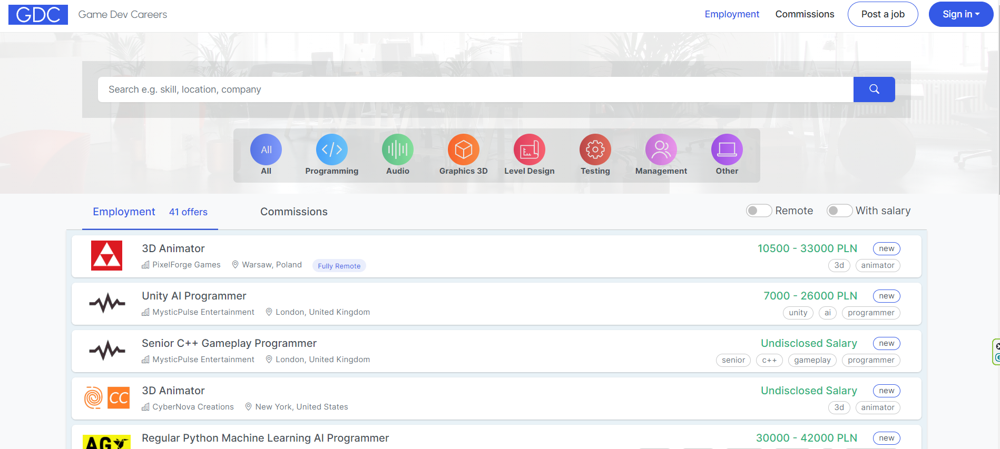

# Game Dev Careers
🚀 Job Board built on ASP.NET Core MVC.

Test instance deployed on Azure: https://game-dev-careers.azurewebsites.net/

### Features include
- user-friendly application process
- authentication, authorization (with OAuth integration)
- managing profile (upload resume or photo)
- lightweight management system for applications, offers, and admin management
- stripe integration
- mails (via SMTP)

### Technologies
- ASP.NET Core MVC
- MS SQL Server with EF Core (ORM)
- Azure (App Service, Blob Storage)
- Redis
- xUnit
- FluentValidation
- HTML, CSS, JavaScript
- JQuery
- Bootstrap

### Test accounts
#### Companies
https://game-dev-careers.azurewebsites.net/signin-employer-panel
- email: game.dev.careers.petproject+generated-company-pixelforge-games@gmail.com, password: 1234567890!
- email: game.dev.careers.petproject+generated-company-some-games@gmail.com, password: 1234567890!
- email: game.dev.careers.petproject+generated-company-nebulabyte-interactive@gmail.com, password: 1234567890!
- email: game.dev.careers.petproject+generated-company-mysticpulse-entertainment@gmail.com, password: 1234567890!
- email: game.dev.careers.petproject+generated-company-cybernova-creations@gmail.com, password: 1234567890!
- email: game.dev.careers.petproject+generated-company-arcanesparrow-games@gmail.com, password: 1234567890!

#### Users
https://game-dev-careers.azurewebsites.net/signin-employee
- email: game.dev.careers.petproject+generated-employee-sarah-johnsonsmith@gmail.com, password: 1234567890!
- email: game.dev.careers.petproject+generated-employee-diego-martinezgonzalez@gmail.com, password: 1234567890!
- email: game.dev.careers.petproject+generated-employee-max-fischerschmidt@gmail.com, password: 1234567890!
- email: game.dev.careers.petproject+generated-employee-mia-wangli@gmail.com, password: 1234567890!
- email: game.dev.careers.petproject+generated-employee-lily-chenwu@gmail.com, password: 1234567890!

#### Admins
https://game-dev-careers.azurewebsites.net/signin-admin
- email: game.dev.careers.petproject+generated-admin-admin1@gmail.com, password: 1234567890!
- email: game.dev.careers.petproject+generated-admin-admin2@gmail.com, password: 1234567890!
- email: game.dev.careers.petproject+generated-admin-admin3@gmail.com, password: 1234567890!
